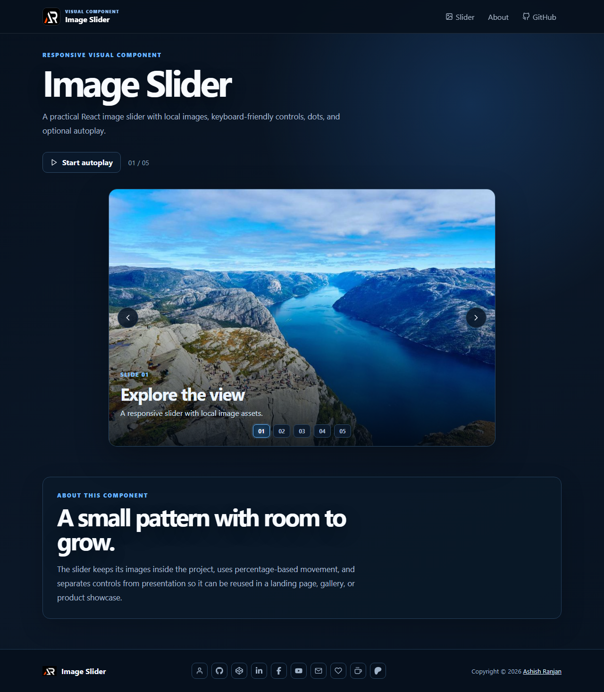

# Image Slider

A responsive React image slider with local image assets, manual navigation, slide indicators, captions, and optional autoplay.

## Features

- Responsive percentage-based slide movement
- Previous, next, dot, and autoplay controls
- Local image assets with accessible labels
- Fixed responsive header, icon-only footer links, and go-to-top button

## Tech stack

React, Create React App, Sass, and React Icons.

## Run locally

```bash
npm install
npm start
```

Create a production build with `npm run build` and deploy it with `npm run deploy`.

## Screenshot



## Links

- Live: [https://a2rp.github.io/image-slider/](https://a2rp.github.io/image-slider/)
- Repository: [https://github.com/a2rp/image-slider](https://github.com/a2rp/image-slider)
- Portfolio: [https://www.ashishranjan.net/](https://www.ashishranjan.net/)
- GitHub: [https://github.com/a2rp](https://github.com/a2rp)
- CodePen: [https://codepen.io/ash1198](https://codepen.io/ash1198)
- LinkedIn: [https://www.linkedin.com/in/aashishranjan](https://www.linkedin.com/in/aashishranjan)
- Facebook: [https://www.facebook.com/theash.ashish/](https://www.facebook.com/theash.ashish/)
- YouTube: [https://www.youtube.com/@ashishranjan-ashz?sub_confirmation=1](https://www.youtube.com/@ashishranjan-ashz?sub_confirmation=1)
- Email: [ash.ranjan09@gmail.com](mailto:ash.ranjan09@gmail.com)

## Support

- Support: [https://a2rp-donation-page.netlify.app/](https://a2rp-donation-page.netlify.app/)
- Buy Me a Coffee: [https://buymeacoffee.com/a2rp](https://buymeacoffee.com/a2rp)
- Patreon: [https://www.patreon.com/a2rp](https://www.patreon.com/a2rp)
